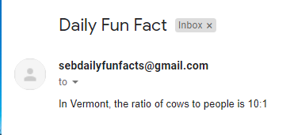

# DailyFunFact
Serverless Web App which allows users to subscribe to daily fun fact emails.

## Lambda ##

This project utilizes a java lambda function in order to automate the daily sending of the emails to subscribers. The lambda utilizes a config.properties file in order to hide confidential data as well as allow the program to be usable by others. The lambda pulls the emails from the DynamoDB Table and then calls a [Fun Fact API](https://uselessfacts.jsph.pl/ "Fun Fact API") to fill the content of the email. Using JavaXMail and a gmail account, I am able to use google's smtp server in order to send the daily facts to the subscribers. I use TLS for the trasnport and MimeMessage to build the email componenets together.

Sample email:

## DynamoDB ##

This project uses a fairly simple table within DynamoDB called fun_fact. It is used to store all the subscribers to the emails and is conveniently pulled through a DynamoDB Scan request in the lambda function. The primary key is the emails.

## Website ##

WIP
